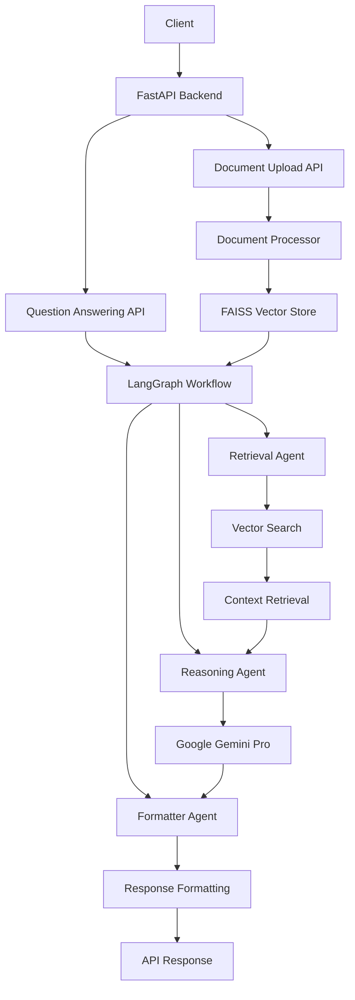
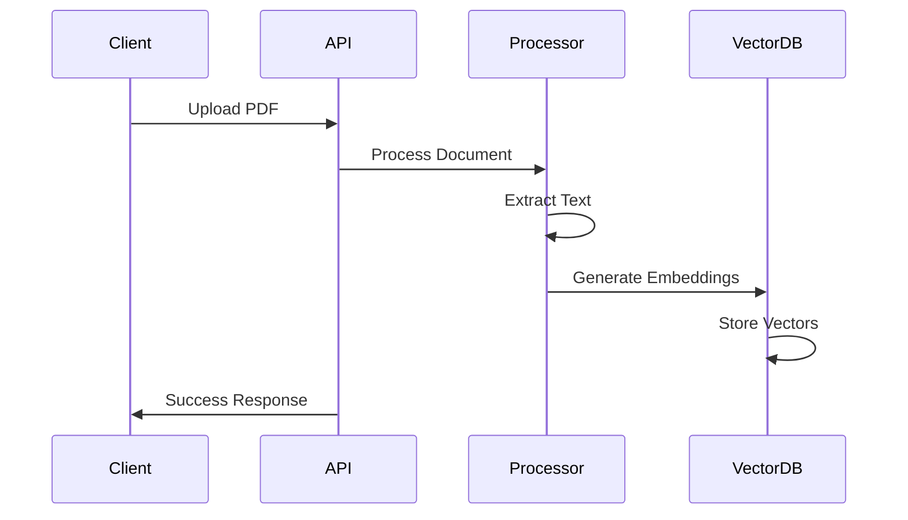
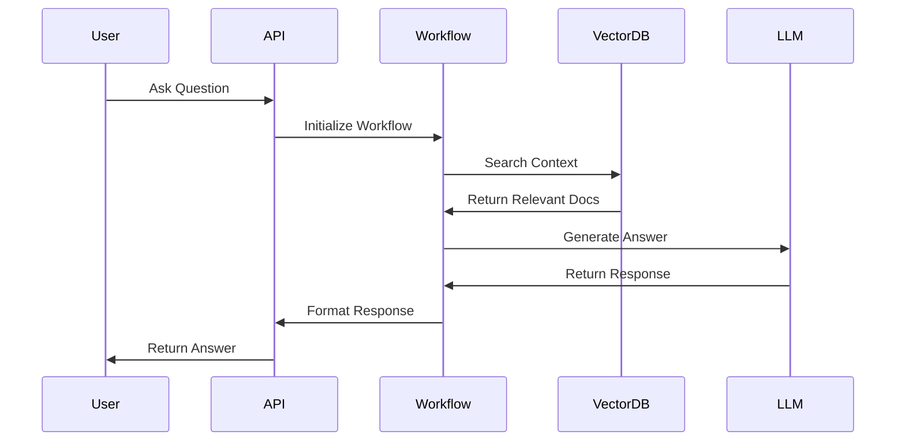
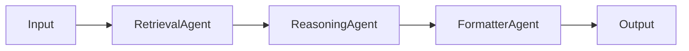
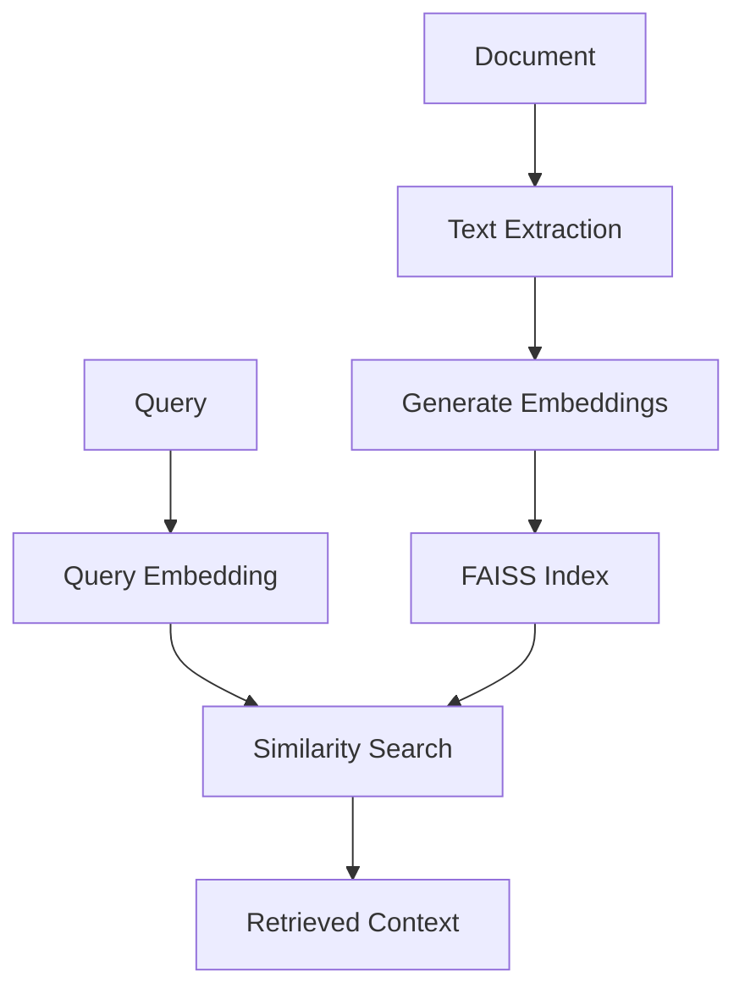
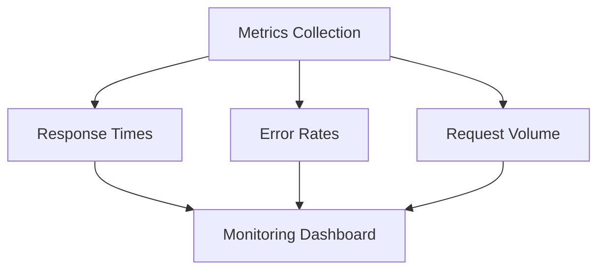

# 🤖 LangGraph Document QA System

> **Last Updated**: 2025-03-20 14:23:08 UTC  
> **Author**: srikrishnavansi

An intelligent document question-answering system powered by LangGraph and Google's Generative AI, built with FastAPI.

## 📊 System Architecture



## 🚀 Features

### Document Processing Pipeline



### Question Answering Flow



## 🛠️ Technical Stack

- **Backend Framework**: FastAPI
- **AI Model**: Google Gemini Pro
- **Vector Database**: FAISS
- **Workflow Engine**: LangGraph
- **Container**: Docker
- **Documentation**: OpenAPI/Swagger

## 📝 API Documentation

### 1. Document Upload Endpoint

```http
POST /api/v1/documents/upload
Content-Type: multipart/form-data
```

#### Request

```python
file: UploadFile  # PDF file
```

#### Response - Success

```json
{
    "message": "Document processed successfully"
}
```

#### Response - Error

```json
{
    "error": {
        "code": 400,
        "message": "Only PDF files are supported",
        "type": "validation_error"
    }
}
```

### 2. Question Answering Endpoint

```http
POST /api/v1/ask
Content-Type: application/json
```

#### Request

```json
{
    "query": "What are the key points in the document?"
}
```

#### Response

```json
{
    "answer": "Detailed answer based on the document...",
    "sources": ["document_name.pdf"]
}
```

## 🔧 Installation & Setup

### Local Development

```bash
# Clone repository
git clone https://github.com/yourusername/langgraph-qa.git
cd langgraph-qa

# Create virtual environment
python -m venv .venv
source .venv/bin/activate  # Linux/Mac
.venv\Scripts\activate     # Windows

# Install dependencies
pip install -r requirements.txt

# Set environment variables
export GOOGLE_API_KEY=your_api_key_here  # Linux/Mac
set GOOGLE_API_KEY=your_api_key_here     # Windows

# Run the application
uvicorn src.main:app --reload
```

### 🐳 Docker Deployment

```bash
# Build the image
docker build -t langgraph-agent .

# Run the container
docker run -d \
    --name langgraph-container \
    -p 8000:8000 \
    -e GOOGLE_API_KEY=your_api_key_here \
    langgraph-agent
```

## 📁 Project Structure

```plaintext
langgraph-qa/
├── src/
│   ├── __init__.py
│   ├── main.py
│   ├── api/
│   │   ├── __init__.py
│   │   └── routes.py
│   ├── core/
│   │   ├── __init__.py
│   │   ├── workflow.py
│   │   ├── logger.py
│   │   └── document_manager.py
│   ├── agents/
│   │   ├── __init__.py
│   │   ├── retrieval.py
│   │   ├── reasoning.py
│   │   └── formatter.py
│   └── models/
│       ├── __init__.py
│       └── schema.py
├── Dockerfile
├── requirements.txt
├── .env
└── README.md
```

## 🔍 Evaluation Criteria Implementation

### 1. FastAPI Implementation
- ✅ RESTful API endpoints
- ✅ OpenAPI/Swagger documentation
- ✅ Request/Response validation
- ✅ Async request handling
- ✅ Proper routing structure

### 2. LangGraph Workflow



### 3. Vector Database Implementation



## 📈 Performance Monitoring



## 🔐 Environment Variables

| Variable | Description | Required | Default |
|----------|-------------|----------|---------|
| GOOGLE_API_KEY | Google API Key | Yes | - |
| PORT | Server Port | No | 8000 |
| HOST | Server Host | No | 0.0.0.0 |

## 🧪 Testing

```bash
# Upload Document
curl -X POST "http://localhost:8000/api/v1/documents/upload" \
     -H "Content-Type: multipart/form-data" \
     -F "file=@/path/to/your/document.pdf"

# Ask Question
curl -X POST "http://localhost:8000/api/v1/ask" \
     -H "Content-Type: application/json" \
     -d '{
       "query": "What are the key points in the document?"
     }'
```

## 📚 API Documentation Access

- Swagger UI: `http://localhost:8000/docs`
- ReDoc: `http://localhost:8000/redoc`

## 🤝 Contributing

1. Fork the repository
2. Create your feature branch
3. Commit your changes
4. Push to the branch
5. Create a new Pull Request

## 📄 License

MIT License - see the [LICENSE](LICENSE) file for details
